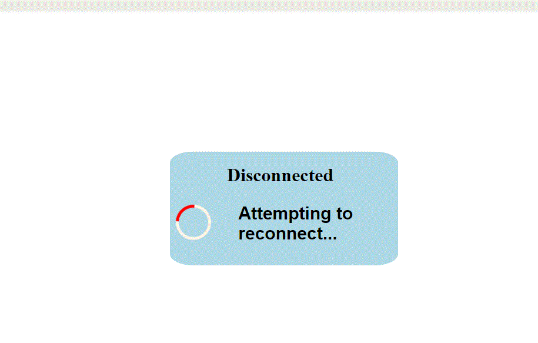
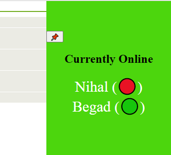

# Live

See the app running here - https://nihchat.nihalnavath.com/

🎉 New v2 released on 20-10-2021! see changelog

# About

Source code for NihChat

A cool af web chat app that includes features such as disconnection message, username login, one username per user feature, live connected users counter.

---

# Installing

Installing is as simple as running

```bash
$ git clone https://github.com/SegsyNihal/NihChat-Socketio-demo-app
```

then run this in the cloned directory to install the dependencies

```bash
$ npm install
```

then run the following command to run NihChat

```bash
$ node .
```

---

Features - <br>
• Disconnection notifier <br>
• Login system<br>
• Remembers History<br>
• Username per user limit<br>
• Online users board<br>
• Simple ui<br>
• Total online counter <br>
• Remembers username<br>
• Spam prevention <br>
• Status (online,away and busy) <br>
• Cool css and html.😎<br>

## See live demo here - [Link]

## Screenshots






## Contributing

Please read [CONTRIBUTING.md](./CONTRIBUTING.md) for details on our code of conduct, and the process for contributing and submitting pull requests to us.

## Contributors

Contributors ---<br>
Begad - https://github.com/Begad666 <br>
kellofkindles - https://github.com/kellofkindles <br>
